# 🗄️ Ecommerce Database Architecture Diagram

## 📊 Entity Relationship Diagram (ERD)



```mermaid
erDiagram
    %% User Management
    USERS {
        string id PK
        string email UK
        string password
        string firstName
        string lastName
        string phoneNumber
        enum role
        boolean emailVerified
        boolean phoneVerified
        boolean active
        timestamp createdAt
        timestamp updatedAt
    }

    PASSWORD_RESET_TOKENS {
        string id PK
        string userId FK
        string token
        timestamp expiryDate
        timestamp createdAt
    }

    %% Product Catalog
    CATEGORIES {
        string id PK
        string name
        string description
        string parentId FK
        boolean featured
        boolean active
        int sortOrder
        int productCount
        timestamp createdAt
        timestamp updatedAt
    }

    PRODUCTS {
        string id PK
        string name
        string description
        decimal price
        decimal originalPrice
        decimal discountPercentage
        string category
        string subCategory
        string brand
        string model
        string sku
        int stockQuantity
        int minStockLevel
        int reviewCount
        decimal averageRating
        decimal weight
        string dimensions
        string imageUrl
        boolean featured
        boolean active
        timestamp createdAt
        timestamp updatedAt
    }

    PRODUCT_IMAGES {
        string id PK
        string productId FK
        string imageUrl
        string altText
        int sortOrder
        boolean primary
        timestamp createdAt
    }

    %% Shopping Cart
    CARTS {
        string id PK
        string userId FK
        enum status
        decimal subtotal
        decimal taxAmount
        decimal totalAmount
        string discountCode
        decimal discountAmount
        timestamp createdAt
        timestamp updatedAt
    }

    CART_ITEMS {
        string id PK
        string cartId FK
        string productId FK
        int quantity
        decimal unitPrice
        decimal totalPrice
        timestamp createdAt
    }

    %% Orders
    ORDERS {
        string id PK
        string userId FK
        string orderNumber UK
        enum status
        enum paymentStatus
        decimal subtotal
        decimal taxAmount
        decimal shippingAmount
        decimal totalAmount
        string deliveryAddress
        string paymentMethod
        string shippingMethod
        string notes
        timestamp orderDate
        timestamp createdAt
        timestamp updatedAt
    }

    ORDER_ITEMS {
        string id PK
        string orderId FK
        string productId FK
        int quantity
        decimal unitPrice
        decimal totalPrice
        timestamp createdAt
    }

    %% Payments
    PAYMENTS {
        string id PK
        string orderId FK
        string userId FK
        string transactionId UK
        enum status
        enum paymentMethod
        decimal amount
        string currency
        string gatewayResponse
        timestamp paymentDate
        timestamp createdAt
        timestamp updatedAt
    }

    %% Relationships
    USERS ||--o{ PASSWORD_RESET_TOKENS : "has"
    USERS ||--o{ CARTS : "owns"
    USERS ||--o{ ORDERS : "places"
    USERS ||--o{ PAYMENTS : "makes"

    CATEGORIES ||--o{ CATEGORIES : "parent-child"
    CATEGORIES ||--o{ PRODUCTS : "contains"

    PRODUCTS ||--o{ PRODUCT_IMAGES : "has"
    PRODUCTS ||--o{ CART_ITEMS : "added_to"
    PRODUCTS ||--o{ ORDER_ITEMS : "ordered_in"

    CARTS ||--o{ CART_ITEMS : "contains"
    ORDERS ||--o{ ORDER_ITEMS : "contains"
    ORDERS ||--o{ PAYMENTS : "has"

    CART_ITEMS }o--|| PRODUCTS : "references"
    ORDER_ITEMS }o--|| PRODUCTS : "references"
    CART_ITEMS }o--|| CARTS : "belongs_to"
    ORDER_ITEMS }o--|| ORDERS : "belongs_to"
    PAYMENTS }o--|| ORDERS : "for"
```

## 🏗️ Database Schema Overview

### 📋 **Core Tables: 9 Main Entities**

| Table | Purpose | Records | Key Features |
|-------|---------|---------|--------------|
| **USERS** | User accounts & profiles | 7 sample users | Authentication, roles, verification |
| **CATEGORIES** | Product classification | 8 categories | Hierarchical structure, featured flags |
| **PRODUCTS** | Product catalog | 6 sample products | Pricing, inventory, ratings |
| **CARTS** | Shopping cart sessions | Dynamic | Status tracking, discount support |
| **CART_ITEMS** | Cart contents | Dynamic | Quantity, pricing |
| **ORDERS** | Customer orders | Dynamic | Status tracking, payment status |
| **ORDER_ITEMS** | Order contents | Dynamic | Product details, quantities |
| **PAYMENTS** | Payment transactions | Dynamic | Gateway integration, status tracking |
| **PRODUCT_IMAGES** | Product media | Dynamic | Multiple images per product |

## 🔗 **Key Relationships**

### 1. **User Hierarchy** 👥
```
USERS (1) ←→ (Many) CARTS
USERS (1) ←→ (Many) ORDERS  
USERS (1) ←→ (Many) PAYMENTS
```

### 2. **Product Organization** 🏷️
```
CATEGORIES (1) ←→ (Many) PRODUCTS
CATEGORIES (1) ←→ (Many) CATEGORIES (self-referencing)
PRODUCTS (1) ←→ (Many) PRODUCT_IMAGES
```

### 3. **Shopping Flow** 🛒
```
USERS → CARTS → CART_ITEMS → PRODUCTS
USERS → ORDERS → ORDER_ITEMS → PRODUCTS
USERS → PAYMENTS → ORDERS
```

### 4. **Data Integrity** 🔒
- **Foreign Key Constraints** ensure referential integrity
- **Unique Constraints** on email, order numbers, transaction IDs
- **Cascade Operations** for data cleanup

## 📊 **Sample Data Structure**

### **Users Table**
```sql
-- Sample user records
admin@ecommerce.com (ADMIN role)
john.doe@example.com (USER role)
jane.smith@example.com (USER role)
-- + 4 more users
```

### **Categories Table**
```sql
-- Root categories
Electronics, Clothing, Home & Garden, Books
-- Subcategories  
Smartphones, Laptops, Men's Clothing, Women's Clothing
```

### **Products Table**
```sql
-- Sample products
iPhone 15 Pro, Samsung Galaxy S24, MacBook Pro 14"
Dell XPS 13, Men's T-Shirt, Women's Summer Dress
```

## 🎯 **Database Features**

### ✅ **Implemented Features**
- **ACID Compliance** through H2/MySQL
- **Transaction Management** for orders/payments
- **Data Validation** through JPA annotations
- **Audit Fields** (createdAt, updatedAt)
- **Soft Delete Support** through active flags
- **Hierarchical Data** (category tree)

### 🔮 **Future Enhancements**
- **Full-Text Search** indexing
- **Audit Logging** for compliance
- **Data Partitioning** for large datasets
- **Read Replicas** for performance
- **Caching Layer** (Redis integration)

## 🚀 **Performance Considerations**

### **Indexing Strategy**
- **Primary Keys**: UUID-based for scalability
- **Foreign Keys**: Indexed for join performance
- **Search Fields**: Email, product names, SKUs
- **Status Fields**: Order status, payment status

### **Query Optimization**
- **Pagination** for large result sets
- **Eager Loading** for related entities
- **Lazy Loading** for large collections
- **Batch Operations** for bulk updates

---

**Database Architecture Status: ✅ COMPLETE & OPTIMIZED**

This architecture supports a full-featured ecommerce platform with scalability, performance, and maintainability in mind.
